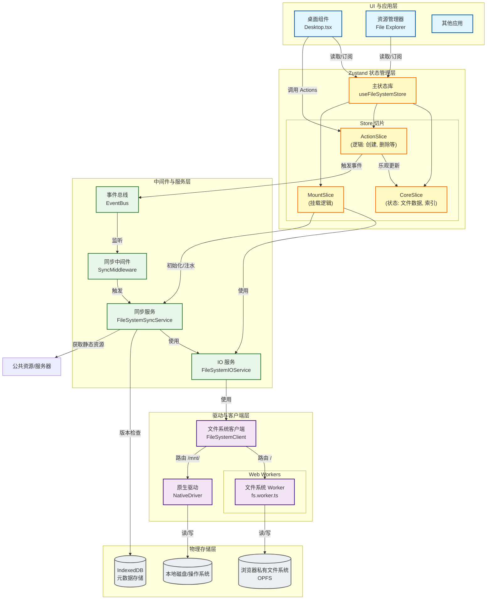

# 🥥 Coconut OS

[](https://nextjs.org/)
[](https://react.dev/)
[](https://tailwindcss.com/)
[](LICENSE)

> **Coconut OS** 是一个基于 **Next.js 16 + React 19** 打造的现代化、全栈级浏览器端虚拟桌面操作系统。它不仅拥有极致丝滑的现代 UI/UX 视效，更深度集成了 **WebContainer（浏览器内运行 Node.js 终端）**、**WebLLM（WebGPU 加速离线大模型）**、**OPFS 多源虚拟文件系统**、**WASM x86 模拟器** 和 **React 实时运行沙箱**，是一个为开发者与极客量身定制的“浏览器开发者游乐场”。

---

## ✨ 核心特性与技术亮点

### ⚡ 1. WebContainer 全栈云端开发环境
基于 `@webcontainer/api`，在浏览器沙箱中瞬间启动一个真实的 Node.js 运行环境：
*   **虚拟终端 (Terminal)**：集成 `xterm.js`，支持执行命令，如运行 `npm install`、`npm run dev` 甚至直接启动本地 Express 或 Vite 开发服务器。
*   **Monaco IDE (VS Code Lite)**：内置轻量级 VS Code（采用 Monaco Editor），支持代码高亮、智能补全与语法检查。配合 WebContainer 实现所见即所得的浏览器端全栈开发。
*   **预热机制 (Warmup)**：在网络与设备性能良好时，系统会在后台通过 `requestIdleCallback` 自动预热 WebContainer 实例，大幅缩减首次打开终端的加载时间。

### 🧠 2. 端侧离线 AI 助手 (WebLLM & Copilot)
借助 `@mlc-ai/web-llm` 与 WebGPU 硬件加速，在浏览器内提供完全本地化、隐私安全的 AI 推理引擎：
*   **100% 本地运行**：直接在 Web Worker 里加载并运行本地大语言模型（如 Llama 3/Qwen 等），无需调用云端 API，无需任何 API Key，断网亦可使用。
*   **Copilot 侧边栏模式**：支持将 AI 助手以 `Sidebar` 贴边模式打开，与桌面及 IDE 保持无缝上下文交互，随时辅助编程和文本处理。

### 📂 3. 多源虚拟文件系统 (VFS)
针对 Web 场景精心设计的高性能抽象文件系统：
*   **OPFS 驱动**：使用 Web Worker 异步操作浏览器私有文件系统（Origin Private File System），实现非阻塞、超高吞吐量的本地虚拟文件读写。
*   **物理磁盘挂载 (Native Driver)**：利用浏览器 `File System Access API`，支持将本地真实的电脑物理文件夹（如 `/mnt/d`）安全挂载到 Coconut OS。在虚拟桌面中对文件的任何修改，将直接同步写入您的物理硬盘！
*   **云端静态资源**：通过 `StaticHttpProvider` 无缝集成只读的网络静态资源（如自带音频、示例图片、壁纸等）。

### 💻 4. x86 虚拟机模拟器 (Retro PC)
内置基于 WebAssembly 的 `v86` 模拟器：
*   **浏览器跑系统**：下载 SeaBIOS、VGA BIOS，能够以极高的 WASM 执行性能，在浏览器虚拟窗口中模拟运行真实的操作系统（如简易 Linux、MS-DOS 等）。

### 🧪 5. 实时 React 组件沙箱 (Code Runner)
基于 `react-runner` 与 `@babel` AST 编译解析：
*   **即时编译**：在浏览器里直接编写 React (JSX/TSX) 组件或 JS 脚本，一键编译、渲染并实时预览，让整个操作系统成为您随时随地调试组件的沙盒。

### 🎨 6. 极致仿真的现代虚拟桌面 UI/UX
*   **多窗口管理器 (Window Manager)**：基于 Zustand 与 Framer Motion，提供丝滑的最大化、最小化、多级堆叠、拖拽改变大小及层级切换动画。
*   **控制中心与小组件**：配有类似于 Windows/macOS 的快速设置面板（更换壁纸、主题色、语言、亮度）、控制中心、系统时钟小组件以及天气预报。
*   **进程管理器**：每隔 2 秒对后台任务和进程状态进行 tick 轮询，支持查看 CPU 负载模拟、内存状态并强行杀死顽固进程。
*   **完善的应用生态**：包含记事本 (Notepad)、网页浏览器 (Browser)、照片画廊 (Photo Gallery)、回收站 (Recycle Bin)、波形展示音乐播放器 (Music Player, 基于 wavesurfer.js)。
*   **OOBE 开箱向导 (SetupWizard)**：第一次进入系统时，提供精致的初始化系统配置和新手引导引导。

---

## 🏗️ 系统架构设计

项目采用高度模块化、事件驱动的架构设计，确保了底层服务（VFS、WebContainer、Worker）与应用表现层（Zustand、React Components）的低耦合性。

以下是 Coconut OS 的核心文件系统及数据流架构图：



---

## 🚀 快速开始

### 1. 前置环境要求
*   Node.js 20.x 或更高版本
*   支持 WebGPU 的现代浏览器（如最新版的 Chrome, Edge, Opera 等，用于离线 AI）

### 2. 获取并初始化项目
克隆本仓库到您的本地目录：
```bash
git clone https://github.com/moslem435/cocount.git
cd cocount
```

安装项目依赖：
```bash
npm install
```
> 💡 **提示**：安装依赖时，系统将自动触发 `postinstall` 钩子，运行 `node scripts/copy-monaco.js`，该脚本会将 `node_modules` 下的 Monaco Editor 静态资源拷贝至项目的 `public/monaco-editor/vs` 目录，以供浏览器按需加载。

### 3. 下载 x86 虚拟机 (Retro PC) 依赖
运行以下脚本，从 CDN 自动下载 v86 虚拟机所需的 WASM 主库、SeaBIOS 以及 VGA BIOS 固件文件：
```bash
node scripts/setup-v86.js
```
下载的静态资源将被放置于 `public/v86` 目录中。

### 4. 运行开发服务器
启动本地开发服务：
```bash
npm run dev
```
> 💡 **提示**：启动命令会首先执行 `node scripts/generate-fs-manifest.js` 扫描项目的 `public/` 目录下（如 `gallery`, `wallpapers`, `icons`, `sounds`）的静态资源，并自动在 public 目录下生成 `fs-manifest.json` 文件系统清单，随后启动 Next.js 本地开发服务。

打开浏览器并访问：`http://localhost:3000` 即可体验。

---

## 🛡️ 部署与安全响应头配置 (避坑指南)

> [!WARNING]
> **极其重要：** WebContainer 和 OPFS (Origin Private File System) 底层依赖于高安全级别的隔离环境。为了使它们能够在生产环境下正常工作，您部署的 HTTP 服务器 **必须** 配置并返回以下两个核心响应头（即启用 COOP 和 COEP）：
> - `Cross-Origin-Opener-Policy: same-origin`
> - `Cross-Origin-Embedder-Policy: require-corp`
>
> 如果没有正确配置上述响应头，WebContainer 终端将无法初始化报错，且 OPFS 读写可能会受到浏览器沙箱的安全限制。

### 各平台配置指南：

#### 1. Next.js 自带配置 (Vercel)
项目中的 `next.config.ts` 已内置这些 Header，如果您直接将项目部署在 Vercel 或运行 `npm start`，通常无需额外修改。我们通过 `next.config.ts` 中的 `headers` 进行了如下声明：
```typescript
// next.config.ts
const nextConfig = {
  async headers() {
    return [
      {
        source: '/(.*)',
        headers: [
          { key: 'Cross-Origin-Opener-Policy', value: 'same-origin' },
          { key: 'Cross-Origin-Embedder-Policy', value: 'require-corp' }
        ]
      }
    ]
  }
}
```

#### 2. Nginx 配置
如果您使用 Nginx 反向代理或托管静态构建，请在相应的 `server` 或 `location` 块中添加：
```nginx
location / {
    add_header Cross-Origin-Opener-Policy "same-origin" always;
    add_header Cross-Origin-Embedder-Policy "require-corp" always;
    # 其它配置...
}
```

#### 3. Docker 部署
项目已经内置了 `Dockerfile` 与 `docker-compose.yml`。
您可以直接运行以下命令以容器化方式启动生产环境：
```bash
docker-compose up -d --build
```
容器内部采用 Next.js 生产服务器运行，已自动处理所需的响应头配置。

---

## 📂 源码目录结构

```bash
coconut
├── docs/                      # 文档目录
├── scripts/                   # 预构建/资源下载自动化脚本
│   ├── copy-monaco.js         # Monaco 编辑器静态资源复制
│   ├── generate-fs-manifest.js# 生成虚拟文件系统 VFS 清单
│   └── setup-v86.js           # 自动下载并配置 v86 虚拟机资源
├── public/                    # 静态资源，包括系统壁纸、预装媒体、v86镜像等
├── src/
│   ├── app/                   # Next.js 页面与 App Router (页面入口与 API)
│   ├── apps/                  # 17 个系统内置应用程序的源代码
│   │   ├── ai-chat/           # 离线 AI 聊天助手 (WebLLM)
│   │   ├── browser/           # 浏览器模拟器
│   │   ├── code-runner/       # 实时 React 沙箱
│   │   ├── emulator/          # v86 虚拟机应用 (Retro PC)
│   │   ├── file-explorer/     # 文件管理器 (集成 OPFS & 本地挂载)
│   │   ├── terminal/          # WebContainer 交互终端
│   │   ├── vscode-lite/       # Monaco 文本编辑器/全功能 IDE
│   │   └── ...                # 记事本、音乐播放器、任务管理器等其它应用
│   ├── os/                    # 虚拟操作系统核心内核逻辑
│   │   ├── kernel/            # 系统内核、服务总线、进程/窗口调度中心
│   │   ├── registry/          # 中央应用注册表 (APPS_REGISTRY)
│   │   ├── system/            # 桌面外壳 Shell 构成（桌面、任务栏、窗口框架）
│   │   └── ui/                # 全局通用 UI 控件与弹窗
│   └── components/            # 全局 React 通用业务组件
```

---

## 🤝 贡献与反馈

欢迎各位极客、前端爱好者为 **Coconut OS** 提交 Issue 或 Pull Request！
- **反馈问题**：如果您遇到了 Bug，或有任何绝妙的 Feature 设想，请随时提交 [GitHub Issue](https://github.com/moslem435/cocount/issues)。
- **开发规范**：提交 PR 前请务必执行 `npm run lint` 进行代码风格校验，并确保 `npm run type-check` 能够无错通过。

## 📄 开源协议

本项目基于 **MIT License** 开源，详情请参阅项目中的 [LICENSE](LICENSE) 文件。
