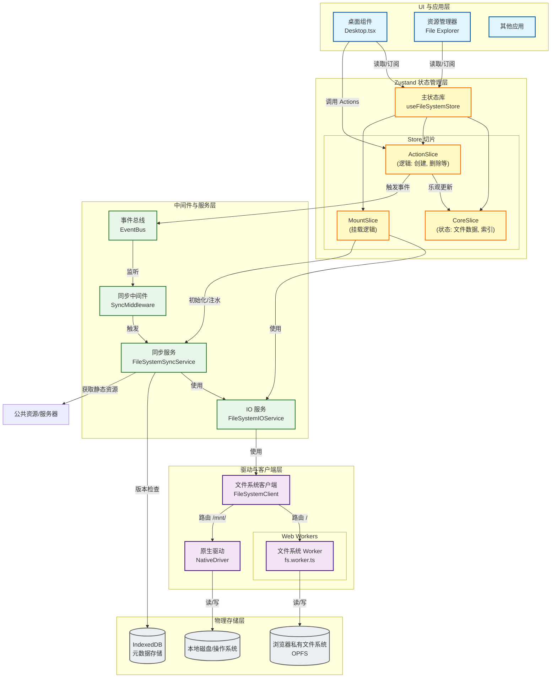

# 文件系统架构图

```mermaid
graph TD
    %% UI Layer
    subgraph UI_Layer [UI 与应用层]
        Desktop[桌面组件<br/>Desktop.tsx]
        FileExplorer[资源管理器<br/>File Explorer]
        OtherApps[其他应用]
    end

    %% State Management Layer
    subgraph State_Layer [Zustand 状态管理层]
        Store[主状态库<br/>useFileSystemStore]
        
        subgraph Slices [Store 切片]
            CoreSlice["CoreSlice<br/>(状态: 文件数据, 索引)"]
            ActionSlice["ActionSlice<br/>(逻辑: 创建, 删除等)"]
            MountSlice["MountSlice<br/>(挂载逻辑)"]
        end
        
        Store --> CoreSlice
        Store --> ActionSlice
        Store --> MountSlice
    end

    %% Middleware Layer
    subgraph Middleware_Layer [中间件与服务层]
        EventBus[事件总线<br/>EventBus]
        SyncMiddleware[同步中间件<br/>SyncMiddleware]
        SyncService[同步服务<br/>FileSystemSyncService]
        IOService[IO 服务<br/>FileSystemIOService]
    end

    %% Driver Layer
    subgraph Driver_Layer [驱动与客户端层]
        FSClient[文件系统客户端<br/>FileSystemClient]
        
        subgraph Workers [Web Workers]
            FSWorker[文件系统 Worker<br/>fs.worker.ts]
        end
        
        NativeDriver[原生驱动<br/>NativeDriver]
    end

    %% Storage Layer
    subgraph Storage_Layer [物理存储层]
        OPFS[(浏览器私有文件系统<br/>OPFS)]
        LocalFS[(本地磁盘/操作系统)]
        IndexedDB[(IndexedDB<br/>元数据存储)]
    end

    %% Connections
    
    %% UI -> Store
    Desktop -->|读取/订阅| Store
    FileExplorer -->|读取/订阅| Store
    Desktop -->|调用 Actions| ActionSlice
    
    %% Store Internal
    ActionSlice -->|乐观更新| CoreSlice
    ActionSlice -->|触发事件| EventBus
    
    %% Middleware Flow
    EventBus -->|监听| SyncMiddleware
    SyncMiddleware -->|触发| SyncService
    
    %% Service Flow
    SyncService -->|使用| IOService
    MountSlice -->|使用| IOService
    IOService -->|使用| FSClient
    
    %% Driver Routing
    FSClient -->|路由 /| FSWorker
    FSClient -->|路由 /mnt/| NativeDriver
    
    %% Worker & IO
    FSWorker -->|读/写| OPFS
    NativeDriver -->|读/写| LocalFS
    
    %% Initialization
    MountSlice -->|初始化/注水| SyncService
    SyncService -->|版本检查| IndexedDB
    SyncService -->|获取静态资源| Server[公共资源/服务器]
    
    %% Styles
    classDef ui fill:#e1f5fe,stroke:#01579b,stroke-width:2px;
    classDef state fill:#fff9c4,stroke:#ff6f00,stroke-width:2px;
    classDef middle fill:#e8f5e9,stroke:#2e7d32,stroke-width:2px;
    classDef driver fill:#f3e5f5,stroke:#4a148c,stroke-width:2px;
    classDef storage fill:#eceff1,stroke:#616161,stroke-width:2px;
    
    class Desktop,FileExplorer,OtherApps ui;
    class Store,CoreSlice,ActionSlice,MountSlice state;
    class EventBus,SyncMiddleware,SyncService,IOService middle;
    class FSClient,FSWorker,NativeDriver driver;
    class OPFS,LocalFS,IndexedDB storage;
```
